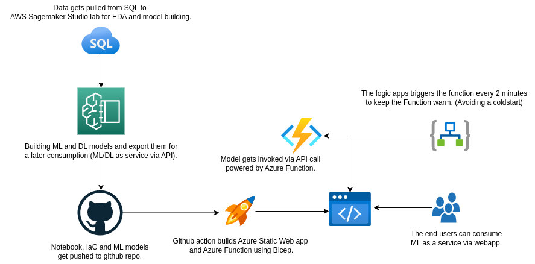
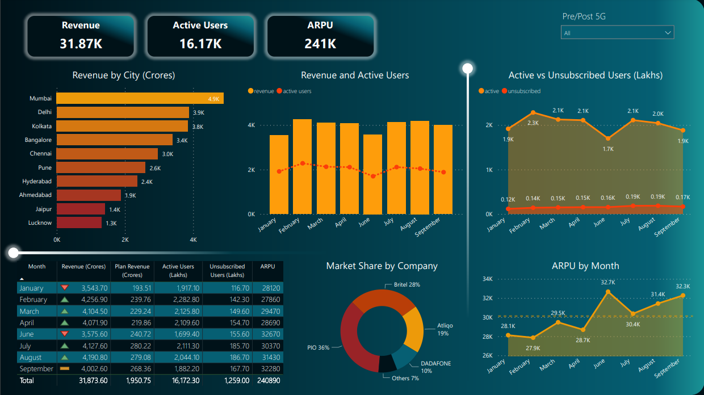

#  Azure Web Apps

## 1. Introduction

### 1.1 Overview

Welcome to the Azure Web Apps repository! This project aims to provide a comprehensive machine learning reference notebook and workflow that can be used by data scientists. The repository includes the following key components:

- **Notebooks**: A collection of notebooks that guide you through the process of building machine learning models.
- **CI/CD Pipeline**: A robust continuous integration and deployment pipeline for deploying web applications to Azure.
- **GitHub Codespace**: A streamlined development environment powered by GitHub Codespaces.

## 2. Logical Architecture

### 2.1 Logical System Component Overview

The logical architecture of this system is designed to facilitate the end-to-end machine learning model deployment process. Here's an overview of the components and their interactions:

1. **Data Acquisition**: Data is extracted from SQL databases and transferred to AWS SageMaker Studio lab for exploratory data analysis (EDA) and model building.
2. **Model Development**: ML and DL models are built using advanced techniques and exported for later consumption as a machine learning/deep learning service via API.
3. **Version Control and Collaboration**: Notebooks, Infrastructure as Code (IaC) templates, and ML models are stored and version-controlled in this GitHub repository, enabling collaboration and reproducibility.
4. **Automated Build Process**: Leveraging GitHub Actions, the repository is set up with an automated build pipeline that constructs an Azure Web App and Azure Function using Bicep, ensuring efficient and consistent deployments.
5. **API Invocation**: The machine learning model is exposed as an API through the Azure Function, enabling seamless integration with other systems and applications.
6. **Keep Function Warm**: Logic Apps are configured to trigger the function every 2 minutes, ensuring that the function remains warm and preventing cold starts for optimal performance.
7. **Web App Consumption**: End users can access the machine learning model as a service through the provided web app, enabling them to make predictions based on the trained models.

## 3. Power BI Dashboard for Visualization

A Power BI dashboard is available to provide a visual representation of the data and insights generated by the machine learning models. This allows for easy analysis and interpretation of the predictions made by the models.

## 4. Azure Web App for AI/ML Demo

Experience the capabilities of various machine learning models through interactive web application demos. Check out the following demos:

